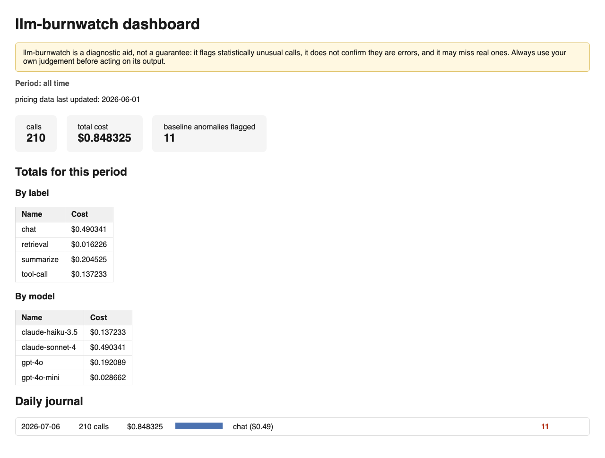

# llm-burnwatch

[](https://github.com/chemodannebro-rgb/llm-burnwatch/actions/workflows/ci.yml)

**Сторож, который следит за тем, сколько на самом деле стоят ваши
вызовы к LLM.**

llm-burnwatch записывает каждый вызов в обычный файл на вашем диске,
учится понимать, как выглядит норма именно для вашего приложения, и
простыми словами предупреждает, если что-то пошло не так: агент
зациклился, промпт незаметно подорожал, случайно включилась не та
модель. Наружу ничего не уходит, пока вы сами не включите оповещение —
Slack, Telegram или вебхук.

[English version](README.md) · [Полная документация](docs/index.ru.md)



## Что он делает

- **Считает расходы.** По каждому вызову — стоимость, токены и
  собственная метка: `"summarize"`, `"chat"` — как удобно вам.
- **Учится на ваших данных.** Ничего настраивать не нужно. Он сам
  смотрит на лог и понимает, как выглядит типичный вызов для каждой
  части вашего приложения.
- **Говорит по-человечески.** «Этот вызов стоил в 20 раз дороже
  обычного» — а не стену статистики. У каждого предупреждения есть
  понятное описание и подсказка, что делать дальше.
- **Умеет остановить зациклившегося агента.** Задайте лимит на один
  запрос, и он бросит ошибку в момент превышения, не дав деньгам
  утечь молча.
- **Живёт только у вас на диске.** Один файл, без обязательных
  зависимостей, без аккаунта, без сервера. Лог можно открыть и
  прочитать глазами.

## Подходит ли это вам?

**Да**, если вы делаете приложение или агента, который обращается к
LLM, и хотите знать, сколько это стоит, и получать предупреждение,
когда что-то не так — без развёртывания целой платформы наблюдаемости.

**Скорее нет**, если вам нужна полная трассировка запросов/ответов и
оценка качества — загляните в [Langfuse](https://langfuse.com/), — или
прокси-сервер перед несколькими провайдерами — загляните в
[LiteLLM](https://www.litellm.ai/). Честное сравнение — в
[docs/comparison.ru.md](docs/comparison.ru.md).

## Установка

```bash
pip install llm-burnwatch
```

## Пять минут до первого предупреждения

**1. Начните записывать вызовы.** Одна строка после каждого вызова к
LLM:

```python
from llm_burnwatch import CostTracker

tracker = CostTracker()
tracker.log_call(
    label="summarize",
    model="gpt-4o-mini",
    input_tokens=812,
    output_tokens=143,
)
```

Уже используете SDK OpenAI, Anthropic, Gemini или LangChain? Запустите
`llm-burnwatch init` — получите готовый сниппет, или смотрите
[docs/connecting.ru.md](docs/connecting.ru.md) для каждого адаптера.

**2. Проверьте, как дела.**

```bash
llm-burnwatch status
```

Простыми словами покажет, что уже под наблюдением, а что ещё
«учится» — настраивать заранее ничего не нужно.

**3. Посмотрите, сколько тратите.**

```bash
llm-burnwatch report
```

**4. Проверьте на аномалии.**

```bash
llm-burnwatch detect
```

Ещё нет своего лога? Попробуйте сначала на демо-данных:

```bash
llm-burnwatch demo-data --out demo.jsonl
llm-burnwatch detect --log-file demo.jsonl
```

**5. Хотите наглядную картину?**

```bash
llm-burnwatch dashboard --out dashboard.html
```

Один самодостаточный HTML-файл — без сервера, без установки чего-либо
ещё.

## Что дальше

| Хочу... | Читать здесь |
|---|---|
| Задать месячный бюджет и получать предупреждение заранее | [docs/budget-vs-guard.ru.md](docs/budget-vs-guard.ru.md) |
| Остановить зациклившегося агента в реальном времени | [docs/budget-vs-guard.ru.md](docs/budget-vs-guard.ru.md) |
| Получать алерты в Slack, Telegram или на свой вебхук | [docs/connecting.ru.md](docs/connecting.ru.md) |
| Понять, как именно каждый детектор решает, что это аномалия | [docs/detectors/](docs/detectors) |
| Импортировать уже имеющиеся данные о расходах (трейсы OpenTelemetry) | [docs/connecting.ru.md](docs/connecting.ru.md) |
| Точно знать, какие данные и когда покидают мой компьютер | [docs/security.ru.md](docs/security.ru.md) |
| Увидеть все команды и флаги | [docs/api.ru.md](docs/api.ru.md) |
| Сравнить с Langfuse, LiteLLM или Helicone | [docs/comparison.ru.md](docs/comparison.ru.md) |
| Найти ответ на вопрос, которого здесь нет | [docs/faq.ru.md](docs/faq.ru.md) |

## Гарантия

Ядро llm-burnwatch никогда не обращается к сети. Всё происходит на
вашем диске. Единственные исключения — то, что включаете *вы сами*:
импорт файла цен по ссылке или отправка алерта в вебхук, Slack,
Telegram или локальную команду через `detect --follow`. Подробности,
включая то, как это проверяется тестами, — в
[docs/security.ru.md](docs/security.ru.md).

## Участие в разработке

```bash
pip install -e ".[anomaly,dev]"
pytest tests/ -v
mypy src/llm_burnwatch
```

Что нужно для PR — в [CONTRIBUTING.md](CONTRIBUTING.md), история
версий — в [CHANGELOG.md](CHANGELOG.md).
